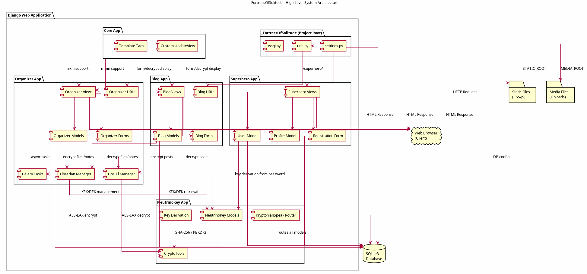
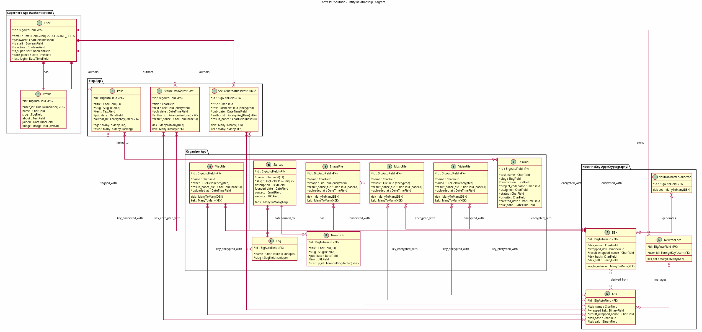
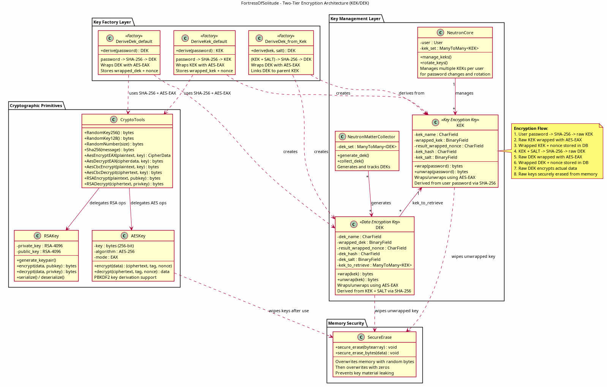
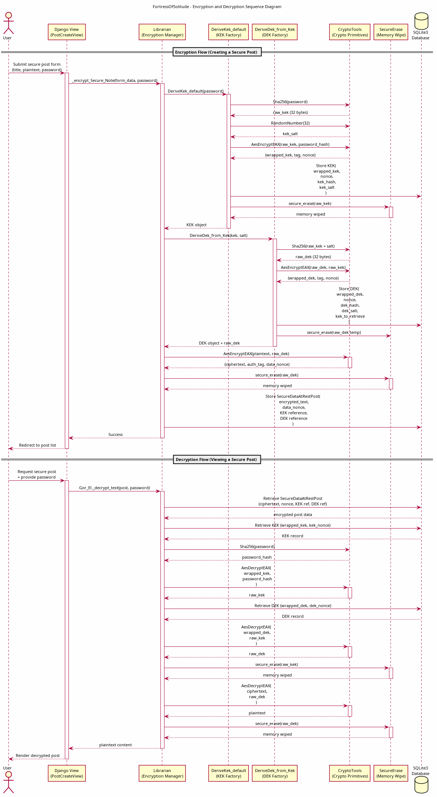
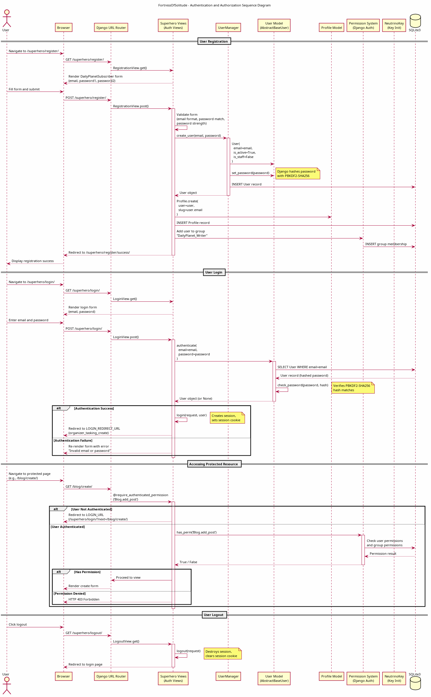
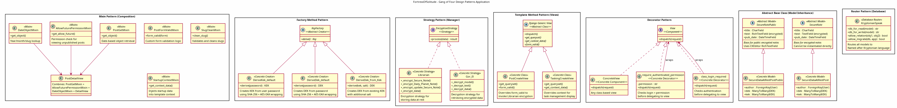
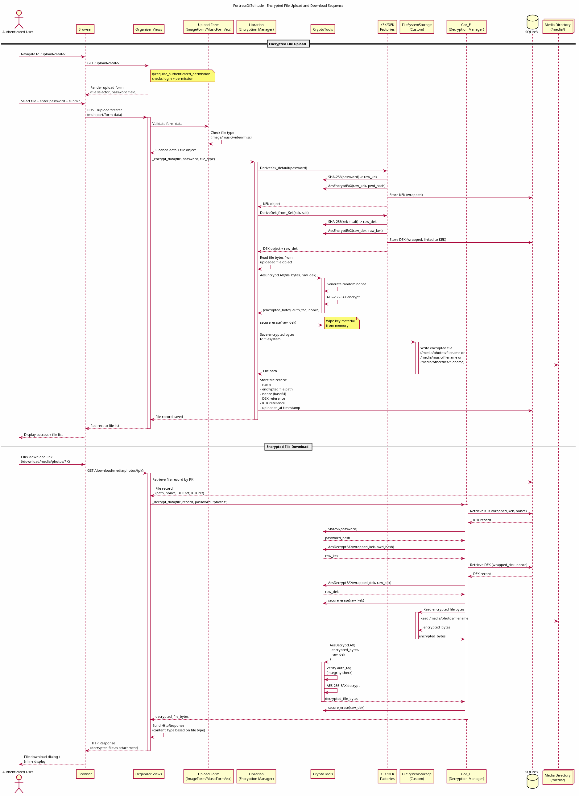
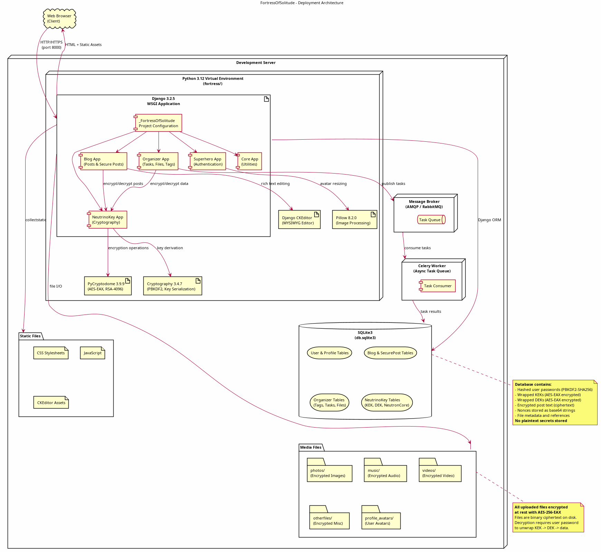

# Software Design Document: FortressOfSolitude

**Project Name:** FortressOfSolitude  
**Version:** 1.0  
**Original Development Period:** 2019 -- 2022  
**Framework:** Django 3.2.5 (Python 3.x)  
**Document Date:** September 2026  

---

## Table of Contents

1. [Introduction](#1-introduction)
2. [System Architecture Overview](#2-system-architecture-overview)
3. [Application Component Design](#3-application-component-design)
4. [Data Model and Database Design](#4-data-model-and-database-design)
5. [Encryption and Cryptographic Architecture](#5-encryption-and-cryptographic-architecture)
6. [Authentication and Authorization Design](#6-authentication-and-authorization-design)
7. [Gang of Four Design Patterns](#7-gang-of-four-design-patterns)
8. [File Management Subsystem](#8-file-management-subsystem)
9. [Deployment Architecture](#9-deployment-architecture)
10. [Security Considerations](#10-security-considerations)

---

## 1. Introduction

### 1.1 Purpose

The FortressOfSolitude is a Django-based web application designed to provide secure data storage, encrypted content management, and personal organization tools. The project draws its thematic identity from the DC Comics Superman universe, with class names, module names, and architectural metaphors drawn from Kryptonian lore. At its core, the application solves a fundamental problem in personal data management: how to store sensitive content -- blog posts, notes, images, music, videos, and miscellaneous files -- with robust encryption at rest, while still providing a usable web interface for everyday interaction. The system implements a two-tier key encryption architecture (KEK/DEK) that ensures data confidentiality even if the underlying database is compromised, because the encryption keys themselves are wrapped and can only be unwrapped with the user's password.

The application was developed between 2019 and 2022, representing a sustained effort to build a comprehensive personal data vault. It combines blogging functionality with task management, startup tracking, and encrypted file storage into a single cohesive platform. The design reflects careful consideration of cryptographic best practices, including authenticated encryption (AES-EAX mode), secure key derivation, and secure memory erasure of sensitive key material after use.

### 1.2 Scope

This document covers the architectural design, component interactions, data modeling, cryptographic subsystems, authentication mechanisms, and design pattern applications within the FortressOfSolitude project. The intended audience includes developers who may contribute to or maintain the project, security auditors evaluating the cryptographic design, and stakeholders seeking to understand the system's capabilities and constraints. The document assumes familiarity with Django's model-view-template architecture and basic cryptographic concepts such as symmetric encryption, key derivation, and nonce-based authenticated encryption.

### 1.3 Definitions and Naming Conventions

The project employs a consistent Superman/Krypton thematic naming convention throughout its codebase. The application name "FortressOfSolitude" refers to Superman's Arctic refuge, serving as a metaphor for a secure data vault. The NeutrinoKey app handles cryptographic operations, with "Neutron" prefixes on key management classes (NeutronCore, NeutronMatterCollector). The Gor_El decryption manager is named after Superman's biological father Jor-El, symbolizing the retrieval and restoration of original data. The Librarian encryption manager represents organized, methodical storage of encrypted content. The Superhero app handles user authentication, and the "Daily Planet" references Superman's newspaper employer, used here for publicly-accessible encrypted content that can be viewed without individual user credentials. Understanding these naming conventions is essential for navigating the codebase, as they appear consistently across models, managers, views, and URL configurations.

---

## 2. System Architecture Overview

### 2.1 High-Level Architecture

The FortressOfSolitude follows Django's model-view-template (MVT) architectural pattern, extended with custom managers, mixins, and cryptographic service layers. The system is organized into five Django applications, each with a distinct responsibility domain, all orchestrated by the central project configuration in the `_FortressOfSolitude` package. The applications communicate through Django's ORM and Python imports, with the NeutrinoKey app serving as a shared cryptographic service layer consumed by both the Blog and Organizer apps.

The following diagram illustrates the high-level system architecture, showing all five applications and their interconnections with the database, static files, media storage, and the client browser.

The architecture follows a layered approach. At the top layer, Django views receive HTTP requests and coordinate responses. The middle layer contains business logic in the form of custom model managers (Librarian and Gor_El) that orchestrate encryption and decryption workflows. The bottom layer provides cryptographic primitives through the CryptoTools class and key management through the KEK/DEK model hierarchy. This separation ensures that view-level code never directly invokes low-level cryptographic functions, instead delegating to the manager layer which handles the full lifecycle of key derivation, data encryption, and secure memory cleanup.

### 2.2 Application Responsibilities

Each of the five Django applications owns a well-defined domain within the system. The Blog app manages blog posts in both plaintext and encrypted forms, supporting date-based archives and tag-based categorization. The Organizer app handles task management, tag taxonomy, startup tracking with associated news links, and encrypted file storage for images, music, videos, and miscellaneous files. The NeutrinoKey app provides the cryptographic foundation, including key models (KEK, DEK), key derivation factories, cryptographic utility functions, and database routing. The Superhero app manages user registration, authentication, and profile management using a custom user model with email-based login. The Core app provides shared utilities including a custom UpdateView and template tags for form rendering and decryption display.

This decomposition means that cryptographic concerns are centralized in NeutrinoKey rather than scattered across the codebase. When the Blog or Organizer apps need to encrypt or decrypt data, they call into the Librarian or Gor_El managers, which in turn use NeutrinoKey's models and CryptoTools. This architectural decision isolates cryptographic complexity and makes it possible to audit or update the encryption implementation in a single location.

### 2.3 Request Processing Pipeline

When a client sends an HTTP request, it passes through Django's middleware stack, which includes SecurityMiddleware, SessionMiddleware, CsrfViewMiddleware, and AuthenticationMiddleware. The URL router in `_FortressOfSolitude/urls.py` dispatches the request to the appropriate app's URL configuration. The Blog, Organizer, and Superhero apps each define their own URL patterns, which map to class-based or function-based views. Views interact with models through Django's ORM, and when encryption is involved, they invoke the Librarian or Gor_El managers. The response is rendered through Django templates and returned to the client. This pipeline ensures that every request is authenticated, CSRF-protected, and routed through the appropriate authorization checks before reaching any business logic.

---

## 3. Application Component Design

### 3.1 Blog Application

The Blog application provides content management for both plaintext and encrypted blog posts. It defines three primary model types: `Post` for standard unencrypted blog entries, `SecureDataAtRestPost` for privately encrypted posts, and `SecureDataAtRestPostPublic` for posts encrypted with a shared public key. Each post is associated with an author (the custom User model), supports tagging through a many-to-many relationship with the Tag model, and can be linked to tasks through a many-to-many relationship with the Tasking model. The date-based archive system supports year and month views, leveraging Django's generic archive views (ArchiveIndexView, YearArchiveView, MonthArchiveView) to provide chronological navigation.

The distinction between `SecureDataAtRestPost` and `SecureDataAtRestPostPublic` is architecturally significant. Private secure posts are encrypted using the individual user's password-derived KEK/DEK chain, meaning only the author can decrypt them by providing their password. Public secure posts, by contrast, use the `DAILY_PLANET_AES_DEK` key defined in settings, which allows any visitor to the site to view the decrypted content. This dual-mode encryption provides flexibility: users can publish encrypted content that is still publicly readable (protecting it at rest on the server) or create truly private encrypted notes that require their personal password to access.

The Blog views use Django's class-based generic views extensively. Create, update, and delete operations are handled by CreateView, the custom Core UpdateView, and DeleteView respectively. Detail views use a combination of custom mixins (PostGetMixin, DateObjectMixin, AllowFuturePermissionMixin) to retrieve posts by date and slug while enforcing permission checks. Form validation for encrypted posts triggers the Librarian manager's encryption methods during the `form_valid` step, ensuring that plaintext content is encrypted before being persisted to the database.

### 3.2 Organizer Application

The Organizer application serves as the project's primary content management and file storage subsystem. It manages several interconnected models: Tag provides a flat taxonomy for categorizing content; Tasking tracks tasks with attributes including assignee, project codename, status, priority, and dates; Startup stores information about startup companies with contact details and websites; and NewsLink associates news articles with specific startups. Beyond these organizational models, the Organizer also houses the encrypted file storage models (ImageFile, MusicFile, VideoFile, MiscFile) and the encryption/decryption manager classes (Librarian and Gor_El).

The Librarian and Gor_El managers are the most architecturally significant components of the Organizer app. The Librarian manager provides four primary encryption methods: `_encrypt_Secure_Note` for private text encryption, `_encrypt_Daily_Planet_Note` for public text encryption, `_encrypt_update_Secure_Note` for updating existing encrypted content, and `_encrypt_data` for encrypting binary file uploads. Each method handles the full encryption lifecycle, including key derivation, data encryption, nonce storage, and secure memory cleanup. The Gor_El manager mirrors this with decryption methods: `_decrypt_model` for retrieving encrypted model data, `_decrypt_text` for decrypting text content (handling both authenticated and anonymous user cases), and `_decrypt_data` for decrypting files by type.

The file storage subsystem uses custom FileSystemStorage instances for each file type (photos, music, videos, other files). When a user uploads a file, the Librarian manager encrypts the file bytes using AES-EAX with a freshly derived DEK, stores the ciphertext to disk via the custom storage backend, and saves the metadata (file path, nonce, KEK/DEK references) to the database. The Organizer also includes Celery integration for asynchronous task processing, enabling long-running operations like batch encryption to be offloaded from the request-response cycle.

### 3.3 NeutrinoKey Application

The NeutrinoKey application is the cryptographic heart of the system. It provides the key management models (KEK, DEK, NeutronCore, NeutronMatterCollector), key derivation factory functions (DeriveKek_default, DeriveDek_default, DeriveDek_from_Kek), and the CryptoTools utility class that wraps PyCryptodome and the Python cryptography library. The application also defines the KryptonianSpeak database router, which controls how models are routed to database backends.

The key management models implement a hierarchical key structure. The KEK (Key Encryption Key) model stores a wrapped (encrypted) key along with its nonce, hash, and salt. The DEK (Data Encryption Key) model stores a similarly wrapped key and maintains a many-to-many relationship (`kek_to_retrieve`) back to the KEK that was used to derive it. The NeutronCore model associates a user with their set of KEKs, supporting key rotation scenarios where a user changes their password and new KEKs are generated. The NeutronMatterCollector model tracks generated DEKs for auditing and management purposes. This hierarchical structure ensures that compromising a single DEK does not expose other encrypted data, and that key rotation can be performed without re-encrypting all existing data.

The CryptoTools class provides a clean interface to cryptographic primitives. It exposes methods for random key generation (256-bit and 128-bit), random number generation for salts and nonces, SHA-256 hashing, AES encryption and decryption in both EAX and CBC modes, and RSA encryption and decryption. The AES-EAX mode is the primary encryption mode, chosen for its authenticated encryption properties -- it provides both confidentiality and integrity verification through an authentication tag, preventing tampering with ciphertext. The RSA support (RSA-4096) provides asymmetric encryption capabilities for scenarios requiring public-key cryptography.

### 3.4 Superhero Application

The Superhero application implements user identity and authentication using a custom user model that extends Django's AbstractBaseUser and PermissionsMixin. The most significant design decision in this app is the use of email as the USERNAME_FIELD instead of a traditional username. The custom UserManager provides `create_user` and `create_superuser` methods that enforce email-based account creation. Each user has an associated Profile model (one-to-one relationship) that stores display information including name, slug, about text, and an avatar image with automatic thumbnail resizing to 300x300 pixels using Pillow.

The registration flow uses a custom form class called `DailyPlanetSubscriber` that collects email and password fields. Upon successful registration, the user is automatically assigned to the "DailyPlanet_Writer" group, which grants a default set of permissions for content creation. The login view uses email and password authentication, and upon successful login, redirects the user to the task creation page (`organizer_tasking_create`). The logout view destroys the session and redirects to the login page. All authentication URLs are namespaced under `dj-auth` to avoid conflicts with other URL patterns.

### 3.5 Core Application

The Core application provides shared utilities consumed by the other applications. Its primary component is a custom UpdateView that overrides the default template suffix to `_form_update`, distinguishing update forms from creation forms in the template hierarchy. The application also provides two custom template tag libraries: `display_form` for rendering Django forms in templates with consistent styling, and `display_decrypt` for handling the display of decrypted content within templates. These template tags encapsulate presentation logic that would otherwise be duplicated across multiple app templates, promoting DRY (Don't Repeat Yourself) principles.

---

## 4. Data Model and Database Design

### 4.1 Entity Relationship Overview

The FortressOfSolitude data model consists of 16 primary entities spanning the four content applications (Blog, Organizer, NeutrinoKey, and Superhero). The relationships between these entities form a network of associations that connect user identity to content, content to encryption keys, and organizational structures to each other. The following entity relationship diagram provides a comprehensive view of all models and their relationships.

The data model can be understood as three interconnected subgraphs. The first subgraph centers on user identity: the User model connects one-to-one with Profile and one-to-many with authored content (Post, SecureDataAtRestPost, SecureDataAtRestPostPublic). The second subgraph covers content organization: Posts connect many-to-many with Tags and Taskings, while Startups connect many-to-many with Tags and one-to-many with NewsLinks. The third subgraph handles encryption: all encrypted content models (SecureDataAtRestPost, SecureDataAtRestPostPublic, ImageFile, MusicFile, VideoFile, MiscFile) connect many-to-many with both KEK and DEK models, while DEK connects many-to-many with KEK through the `kek_to_retrieve` field. NeutronCore connects users to their KEKs, and NeutronMatterCollector tracks DEK generation.

### 4.2 User and Profile Models

The User model diverges from Django's default by using email as the primary identifier. The model stores the email address (unique, used for login), a hashed password (Django's PBKDF2-SHA256), boolean flags for staff and active status, and timestamp fields for date_joined and last_login. The Profile model extends user information with display-oriented fields: name, slug (for URL-friendly profile pages), about text, join date, and an avatar image field. The avatar uses Django's ImageField with a custom upload path (`media/profile_avatars/`) and includes automatic resizing logic in the save method that scales images to a maximum of 300x300 pixels using Pillow's thumbnail function. This ensures consistent avatar dimensions regardless of the uploaded image's original size.

### 4.3 Content Models

The content models span two applications. In the Blog app, the Post model stores a title (max 63 characters), a slug (max 63 characters, used in URLs alongside the publication date), the post text, a publication date, and foreign key to the author. Posts support many-to-many relationships with both Tags and Taskings, enabling content to be categorized and linked to project management items simultaneously. The SecureDataAtRestPost and SecureDataAtRestPostPublic models inherit from the abstract SecureNote and SecureNotePublic base classes respectively, adding author foreign keys and many-to-many relationships with DEK and KEK for tracking which encryption keys were used. The `result_nonce` field stores the AES-EAX nonce as a base64-encoded string, which is required for decryption.

In the Organizer app, the Tag model provides a simple name/slug pair for categorization. The Tasking model is more complex, storing task_name, slug, description, project_codename, assignee, status, priority, created_date, and due_date. The Startup model captures company information including name, slug, description, founded_date, contact email, and website URL, with a many-to-many relationship to Tags. The NewsLink model associates news articles (title, slug, pub_date, link URL) with specific Startups through a foreign key.

### 4.4 Encrypted File Models

The encrypted file models (ImageFile, MusicFile, VideoFile, MiscFile) share a common structure: a name field, a file field pointing to the encrypted binary on disk, a `result_nonce_file` field storing the AES-EAX nonce as base64, an `uploaded_at` timestamp, and many-to-many relationships with both DEK and KEK. Each file type uses a dedicated FileSystemStorage instance configured with a specific subdirectory under the media root (photos, music, videos, otherfiles). When files are uploaded, the Librarian manager reads the raw bytes, encrypts them with AES-EAX using the user's DEK, and writes the ciphertext to the storage backend. The original file bytes never touch disk in plaintext form -- encryption occurs in memory before the write operation.

### 4.5 Key Management Models

The KEK model stores wrapped (encrypted) key material in a BinaryField, along with the wrapping nonce (as a CharField storing base64), a hash of the key for identification, and a salt (BinaryField) used during derivation. The DEK model mirrors this structure and adds the `kek_to_retrieve` many-to-many field that links each DEK back to the KEK from which it was derived. This linkage is critical for the decryption workflow: when decrypting data, the system looks up the associated DEK, follows the `kek_to_retrieve` relationship to find the parent KEK, unwraps the KEK using the user's password, then unwraps the DEK using the KEK, and finally decrypts the data using the DEK.

The NeutronCore model ties the key hierarchy to user identity by associating a User foreign key with a many-to-many set of KEKs. This supports key rotation: when a user changes their password, a new KEK is derived and added to the NeutronCore set, while old KEKs are retained so that previously encrypted data can still be decrypted (the old KEKs remain wrapped with the old password; a re-wrapping migration would be needed to fully rotate). The NeutronMatterCollector tracks DEK generation through a many-to-many relationship with DEKs, providing an audit trail of key creation.

### 4.6 Database Configuration

The application uses SQLite3 as its database backend, configured through Django's standard database settings. The KryptonianSpeak database router routes all models to the `default` database and allows all relations and migrations. While SQLite3 is appropriate for development and personal use, the architecture's use of Django's ORM and database router pattern means that migrating to PostgreSQL or another production-grade database requires only configuration changes in settings.py and the router class, with no changes to model or view code.

---

## 5. Encryption and Cryptographic Architecture

### 5.1 Two-Tier Key Hierarchy

The FortressOfSolitude implements a two-tier key encryption architecture that separates key management from data encryption. This design is inspired by enterprise key management systems and provides defense-in-depth: even if an attacker gains access to the database, they obtain only wrapped (encrypted) keys and encrypted data -- never plaintext keys or plaintext content.

The following class diagram details the full encryption architecture, including the key hierarchy, factory methods, cryptographic primitives, and memory security mechanisms.

At the first tier, the Key Encryption Key (KEK) is derived from the user's password using SHA-256 hashing. The raw KEK is then wrapped (encrypted) using AES-EAX with the password hash as the wrapping key, producing a wrapped KEK, an authentication tag, and a nonce. Only the wrapped KEK and nonce are stored in the database; the raw KEK exists only transiently in memory and is securely erased after use. At the second tier, the Data Encryption Key (DEK) is derived from the raw KEK combined with a random 32-byte salt, again using SHA-256. The raw DEK is wrapped using AES-EAX with the raw KEK as the wrapping key. The wrapped DEK, nonce, and a reference to the parent KEK are stored in the database. The actual data (post text, file bytes) is then encrypted using AES-EAX with the raw DEK, producing ciphertext, an authentication tag, and a data nonce.

This two-tier design provides several security properties. First, changing a user's password requires only re-wrapping the KEK with the new password-derived key, rather than re-encrypting all data. Second, each piece of encrypted data can use a unique DEK, limiting the impact of any single key compromise. Third, the key hierarchy creates a chain of custody: to decrypt any data, an attacker must know the user's password, derive the KEK, unwrap the DEK, and only then can they decrypt the data.

### 5.2 Encryption and Decryption Workflows

The encryption and decryption workflows follow a strict sequence of operations, illustrated in the following timing diagram. This sequence diagram shows the complete lifecycle of a secure post from creation (encryption) through retrieval (decryption), including all intermediate cryptographic operations and secure memory erasure steps.

During encryption, the workflow proceeds as follows. The user submits a form with plaintext content and their password. The view invokes the Librarian manager's encryption method. The Librarian calls DeriveKek_default to create a KEK from the password: the password is hashed with SHA-256 to produce the raw KEK, a random salt is generated, the raw KEK is wrapped with AES-EAX, and the wrapped KEK is stored in the database. Next, the Librarian calls DeriveDek_from_Kek to create a DEK: the raw KEK is combined with a random salt and hashed with SHA-256 to produce the raw DEK, which is then wrapped with AES-EAX using the raw KEK and stored in the database. Finally, the Librarian encrypts the plaintext data using AES-EAX with the raw DEK, stores the ciphertext and data nonce, securely erases the raw DEK and KEK from memory, and returns success.

During decryption, the reverse workflow executes. The user provides their password. The Gor_El manager retrieves the encrypted record and its associated KEK and DEK from the database. The password is hashed with SHA-256, and the result is used to unwrap (decrypt) the KEK using AES-EAX. The unwrapped KEK is then used to unwrap the DEK. The KEK is securely erased from memory. The unwrapped DEK decrypts the data ciphertext using AES-EAX, which also verifies the authentication tag to ensure data integrity. The DEK is securely erased, and the plaintext is returned to the view for rendering.

### 5.3 AES-EAX Authenticated Encryption

The application uses AES-256 in EAX (Encrypt-then-Authenticate-then-translate) mode as its primary encryption algorithm. AES-EAX is an authenticated encryption with associated data (AEAD) mode that provides both confidentiality and integrity protection in a single operation. Each encryption operation produces three outputs: the ciphertext (same length as plaintext), an authentication tag (used to verify that the ciphertext has not been tampered with), and a nonce (a random value that ensures the same plaintext encrypted twice produces different ciphertext). The authentication tag is critical: during decryption, AES-EAX verifies the tag before returning plaintext, and raises an error if the ciphertext or tag has been modified. This prevents both passive eavesdropping and active tampering attacks.

The choice of AES-EAX over other modes (such as AES-CBC, which is also available in CryptoTools but primarily for legacy compatibility) reflects a security-first design philosophy. AES-CBC requires separate MAC computation for integrity protection and is vulnerable to padding oracle attacks if not implemented carefully. AES-EAX handles both concerns atomically, reducing the surface area for implementation errors.

### 5.4 Key Derivation and Secure Memory Management

Key derivation uses SHA-256 hashing to transform passwords and key material into fixed-length 256-bit keys. The CryptoTools class provides `Sha256(message)` for this purpose, along with AESKey support for PBKDF2-based key derivation when additional key stretching is needed. Random salts are generated using `RandomNumber(32)`, which produces 32 bytes (256 bits) of cryptographically secure random data via PyCryptodome's random module.

Secure memory erasure is a distinctive feature of the cryptographic design. The `secure_erase` and `secure_erase_bytes` functions overwrite key material in memory with random bytes, then with zeros, before the Python garbage collector reclaims the memory. This mitigates cold boot attacks and memory dump attacks where an attacker with physical access to the server might extract key material from RAM. While Python's memory management makes guaranteed erasure challenging (the interpreter may create copies of objects), the secure erasure functions represent a best-effort defense that significantly raises the bar for memory-based key extraction.

---

## 6. Authentication and Authorization Design

### 6.1 Authentication Architecture

The Superhero app implements a custom authentication system built on Django's AbstractBaseUser framework. The most notable architectural decision is the use of email addresses as the primary user identifier (USERNAME_FIELD), replacing Django's default username-based authentication. This decision aligns with modern web application conventions where email serves as both the login credential and the primary communication channel.

The following sequence diagram illustrates the complete authentication lifecycle, from user registration through login, protected resource access, and logout.

The registration workflow creates a new User record with a PBKDF2-SHA256 hashed password, an associated Profile record with a slug derived from the email, and assigns the user to the "DailyPlanet_Writer" default group. The login workflow authenticates against the User model's email and hashed password, creates a Django session, and redirects to the task creation page. The logout workflow destroys the session and clears the session cookie. All three flows use Django's built-in session middleware and CSRF protection.

### 6.2 Authorization and Permission Model

The application implements a layered authorization model using Django's permission framework augmented with custom decorators. At the broadest level, the `@login_required` decorator (and its class-based equivalent `@class_login_required`) ensures that only authenticated users can access protected views. At a finer level, the `@require_authenticated_permission` decorator checks both authentication and a specific permission string (e.g., `Blog.add_post`, `organizer.view_tasking`). This decorator combines login verification and permission checking into a single decorator call, reducing boilerplate and ensuring that permission checks cannot be accidentally omitted.

The permission model is organized around Django's default permission types (add, change, delete, view) plus custom permissions. The Blog app defines permissions for viewing, adding, and deleting posts, as well as a custom `view_future_post` permission that controls whether a user can see posts with publication dates in the future. This last permission is enforced through the `AllowFuturePermissionMixin`, which overrides Django's `get_allow_future` method on date-based archive views. The "DailyPlanet_Writer" group serves as the default permission set for new users, granting content creation permissions while restricting administrative operations.

### 6.3 Session and CSRF Protection

Django's session middleware manages user sessions through server-side session storage and client-side session cookies. The CSRF middleware protects against cross-site request forgery by requiring a valid CSRF token with every POST request. The application's current development configuration sets `SECURE_SSL_REDIRECT = False`, `SESSION_COOKIE_SECURE = False`, and `CSRF_COOKIE_SECURE = False`, which is appropriate for local development over HTTP but would need to be changed for production deployment over HTTPS. The XFrameOptionsMiddleware provides clickjacking protection by setting the X-Frame-Options header on responses.

---

## 7. Gang of Four Design Patterns

### 7.1 Pattern Overview

The FortressOfSolitude applies several Gang of Four design patterns, both through Django's built-in framework patterns and through custom implementations specific to the project's encryption and content management requirements. The following diagram maps each pattern to its concrete implementation within the codebase, showing how abstract pattern concepts translate into specific classes and methods.

The patterns employed span three of the four GoF categories: creational (Factory Method), structural (Decorator, Mixin/Composition), and behavioral (Strategy, Template Method). The application also uses the Abstract Base Class pattern for model inheritance and a Database Router pattern for database access control. These patterns were not applied arbitrarily; each addresses a specific design challenge within the application's domain.

### 7.2 Factory Method Pattern

The Factory Method pattern is applied in the key derivation subsystem through three concrete factory functions: `DeriveKek_default`, `DeriveDek_default`, and `DeriveDek_from_Kek`. Each factory encapsulates the complex process of deriving a cryptographic key from input material, wrapping it with AES-EAX, and persisting the wrapped key to the database. Client code (the Librarian and Gor_El managers) calls these factories without needing to understand the details of key derivation, salt generation, or AES wrapping.

The factory pattern is particularly well-suited to key derivation because the creation process involves multiple steps with security implications: generating random salts, performing hash operations, encrypting the key material, and securely erasing intermediate values. Encapsulating this sequence in a factory ensures consistency and prevents callers from accidentally skipping steps (such as secure erasure). The three factories form a hierarchy: `DeriveKek_default` creates top-level KEKs from passwords, `DeriveDek_default` creates standalone DEKs from passwords, and `DeriveDek_from_Kek` creates DEKs derived from existing KEKs. This hierarchy mirrors the two-tier key architecture and ensures that the parent-child relationship between KEKs and DEKs is established correctly at creation time.

### 7.3 Strategy Pattern (Manager Classes)

The Strategy pattern manifests in the Librarian and Gor_El manager classes, which provide interchangeable encryption and decryption strategies for the content models. Both managers implement a common conceptual interface (processing data through cryptographic operations) but with opposite behaviors: Librarian encrypts and stores, while Gor_El retrieves and decrypts. The content models and views act as the context, delegating cryptographic operations to whichever strategy (manager) is appropriate for the current operation.

This strategy-based design means that the encryption and decryption logic is cleanly separated from the model and view layers. A view creating an encrypted post calls `Librarian._encrypt_Secure_Note()` without knowing the details of KEK derivation, DEK creation, AES-EAX encryption, or nonce storage. Similarly, a view displaying an encrypted post calls `Gor_El._decrypt_text()` without managing key unwrapping or authentication tag verification. The strategies can be modified or replaced independently -- for example, switching from AES-EAX to AES-GCM would require changes only within the strategy implementations, not in any calling code.

### 7.4 Template Method Pattern (Django Generic Views)

Django's class-based generic views implement the Template Method pattern, and the FortressOfSolitude leverages this extensively. The generic views (CreateView, DetailView, ListView, DeleteView, ArchiveIndexView, etc.) define the skeleton of the request-handling algorithm -- dispatching the request, validating permissions, loading objects, processing forms, and rendering responses -- while allowing subclasses to override specific "hook" methods to customize behavior.

The Blog and Organizer views override several hook methods to integrate encryption. The `form_valid` method is overridden in post creation views to invoke Librarian encryption after form validation but before database persistence. The `get_object` method is overridden in detail views (via PostGetMixin and DateObjectMixin) to perform date-based slug lookup instead of Django's default primary key lookup. The `get_context_data` method is overridden in list views to inject additional context like decrypted content or startup information. Each override customizes a single step of the algorithm without affecting the overall request-handling flow, which remains defined by the generic view's template method.

### 7.5 Decorator Pattern

The Decorator pattern is applied to views through the `@require_authenticated_permission` and `@class_login_required` decorators. These decorators wrap view classes, intercepting the `dispatch` method to perform authentication and permission checks before the wrapped view processes the request. If the checks fail, the decorator short-circuits the request with a redirect to the login page or a 403 Forbidden response, preventing the wrapped view from executing.

The decorator pattern is architecturally important because it separates cross-cutting concerns (authentication, authorization) from business logic (content creation, file upload). A view class focuses solely on its domain responsibility, while the decorators handle security. This separation makes it easy to change the security policy for a view (e.g., adding or removing permission requirements) without modifying the view's business logic code. The decorators are composable: a view can be wrapped with both `@class_login_required` and `@require_authenticated_permission` to enforce both authentication and specific permissions.

### 7.6 Mixin Pattern (Composition)

The Mixin pattern provides code reuse through multiple inheritance, and the FortressOfSolitude defines several mixins that address common view requirements. `PostFormValidMixin` provides custom form validation logic shared across post creation and update views. `PostGetMixin` and `SecurePostGetMixin` provide object retrieval methods for date-based and encryption-aware lookups respectively. `AllowFuturePermissionMixin` adds permission-based future post visibility. `DateObjectMixin` provides year/month/slug-based object lookup. `SlugCleanMixin` validates and sanitizes slug fields during form processing. `StartupContextMixin` injects startup-related context into template rendering.

These mixins are combined through multiple inheritance to compose view classes with exactly the capabilities they need. For example, the PostDetailView might inherit from PostGetMixin, AllowFuturePermissionMixin, DateObjectMixin, and Django's DetailView, combining date-based lookup, future-post permission checking, and standard detail view rendering into a single class. This compositional approach avoids deep inheritance hierarchies while allowing fine-grained behavior reuse. Each mixin has a single, well-defined responsibility, making the system easy to understand and modify.

### 7.7 Abstract Base Class Pattern (Model Inheritance)

The Abstract Base Class pattern is used in the model layer to share fields and behavior between related models without creating database tables for the abstract classes. The `SecureNote` abstract model defines the common fields for encrypted text content (title, encrypted text, publication date), while `SecureNotePublic` extends this with a RichTextField (from django-ckeditor) for WYSIWYG-edited content. Concrete models (`SecureDataAtRestPost`, `SecureDataAtRestPostPublic`) inherit from these abstract bases and add fields specific to their context (author, DEK/KEK references).

This pattern is particularly effective for the encryption use case because it ensures that all encrypted content models share the same field structure for encrypted text, nonces, and timestamps. If the encryption schema changes (e.g., adding an authentication tag field), the change can be made in the abstract base class and automatically propagated to all concrete models. Django's Meta `abstract = True` flag ensures that no database table is created for SecureNote or SecureNotePublic, avoiding unnecessary joins while maintaining code reuse.

---

## 8. File Management Subsystem

### 8.1 Encrypted File Upload and Download

The file management subsystem handles the upload, encryption, storage, retrieval, decryption, and download of binary files across four categories: images, music, videos, and miscellaneous files. The full upload and download workflow is illustrated in the following sequence diagram.

The upload workflow begins when an authenticated user submits a file through the upload form at `/upload/create/`. The view validates the form data and delegates to the Librarian manager's `_encrypt_data` method. The Librarian derives a KEK from the user's password, derives a DEK from the KEK, reads the raw file bytes into memory, encrypts them with AES-EAX using the DEK, securely erases the DEK from memory, and writes the encrypted bytes to the appropriate FileSystemStorage location. The metadata (file name, storage path, nonce, KEK reference, DEK reference, upload timestamp) is stored in the corresponding model (ImageFile, MusicFile, VideoFile, or MiscFile).

The download workflow reverses this process. When a user requests a file (e.g., `/download/media/photos/{pk}`), the view retrieves the file record from the database and delegates to the Gor_El manager's `_decrypt_data` method. Gor_El retrieves the KEK and DEK from the database, unwraps them using the user's password, reads the encrypted file bytes from disk, decrypts them with AES-EAX (verifying the authentication tag), securely erases the key material, and returns the decrypted bytes. The view constructs an HttpResponse with the appropriate content type and returns the decrypted file to the user's browser, either as an inline display or as a file download attachment.

### 8.2 Storage Architecture

Each file type uses a dedicated Django FileSystemStorage instance configured with a type-specific subdirectory. Image files are stored in `/media/photos/`, music files in `/media/music/`, video files in `/media/videos/`, and miscellaneous files in `/media/otherfiles/`. User profile avatars use a separate path at `/media/profile_avatars/` and are not encrypted (they are publicly visible profile images).

The storage architecture ensures that encrypted files on disk are indistinguishable from random data. Because AES-EAX produces ciphertext that is computationally indistinguishable from random bytes, an attacker with filesystem access cannot determine the type, content, or structure of stored files without the decryption keys. The nonces stored in the database are essential for decryption and are stored as base64-encoded strings to avoid binary encoding issues in CharField storage.

---

## 9. Deployment Architecture

### 9.1 Runtime Environment

The FortressOfSolitude runs within a Python 3.12 virtual environment (`fortress/`) that contains all required dependencies. The application server uses Django's built-in development server (via `manage.py runserver`) for local development, with WSGI configuration available for production deployment behind a web server like Nginx or Apache with mod_wsgi or Gunicorn.

The following deployment diagram shows the complete runtime architecture, including the Django application stack, supporting libraries, Celery worker, message broker, database, and file storage.

The Django application depends on several key libraries. PyCryptodome 3.9.9 provides the AES-EAX and RSA implementations used by CryptoTools. The cryptography library 3.4.7 provides PBKDF2 key derivation and key serialization. Pillow 8.2.0 handles image processing for profile avatar resizing. Django CKEditor provides the WYSIWYG editor for rich text content in SecureNotePublic-derived models. The Celery stack (including amqp, billiard, kombu, and vine) enables asynchronous task processing through a message broker.

### 9.2 Database Deployment

The SQLite3 database stores all application data in a single file (`db.sqlite3`) at the project root. This includes user credentials (hashed passwords), wrapped encryption keys (KEKs and DEKs), encrypted content (blog posts and notes), file metadata (paths, nonces, key references), and organizational data (tags, tasks, startups, news links). No plaintext secrets or plaintext content are stored in the database -- all sensitive content is encrypted before persistence. The database file should be protected with appropriate filesystem permissions to prevent unauthorized direct access, though the encryption-at-rest design provides a second layer of defense even if the database file is compromised.

### 9.3 Asynchronous Processing

The Celery integration in the Organizer app enables long-running tasks to be processed asynchronously. The Celery worker connects to a message broker (typically RabbitMQ or Redis via AMQP) to receive task messages published by the Django application. This architecture is particularly important for operations like batch file encryption or large file processing, where synchronous handling within the HTTP request-response cycle would cause unacceptable latency. The Celery worker has access to the same database and filesystem as the Django application, enabling it to perform encryption operations and store results identically to synchronous code paths.

---

## 10. Security Considerations

### 10.1 Threat Model

The FortressOfSolitude's security design addresses several threat scenarios. The primary threat is unauthorized access to stored data, mitigated by the two-tier KEK/DEK encryption architecture. Even if an attacker obtains a copy of the SQLite3 database, they cannot decrypt any content without the users' passwords. A secondary threat is key material exposure through memory inspection, mitigated by the secure memory erasure functions that overwrite key bytes after use. The authentication layer mitigates unauthorized application access through password-hashed credentials, session management, and permission-based authorization.

### 10.2 Production Hardening Recommendations

The current configuration reflects a development environment and would require several changes for production deployment. The `SECRET_KEY` should be generated uniquely and stored outside version control (e.g., in an environment variable). `DEBUG` should be set to `False` to prevent stack trace exposure. `SECURE_SSL_REDIRECT`, `SESSION_COOKIE_SECURE`, and `CSRF_COOKIE_SECURE` should all be set to `True` to enforce HTTPS. The `DAILY_PLANET_AES_DEK` public encryption key should be moved from settings.py to a secure key management service or environment variable. The database should be migrated from SQLite3 to PostgreSQL or another production-grade database with its own encryption-at-rest capabilities. ALLOWED_HOSTS should be restricted to the actual production domain names.

### 10.3 Cryptographic Strengths

The encryption design demonstrates several strengths. The use of AES-256 in EAX mode provides authenticated encryption, preventing both eavesdropping and tampering. The two-tier key hierarchy limits the blast radius of any single key compromise. The use of random salts and nonces ensures that identical plaintext produces different ciphertext across encryptions. The secure memory erasure of key material reduces the window of vulnerability for memory-based attacks. The separation of public (Daily Planet) and private encryption paths provides flexibility while maintaining security guarantees appropriate to each content type.

---

*This document describes the FortressOfSolitude as designed and implemented between 2019 and 2022. The architecture reflects the design decisions, trade-offs, and cryptographic practices appropriate to that development period.*
